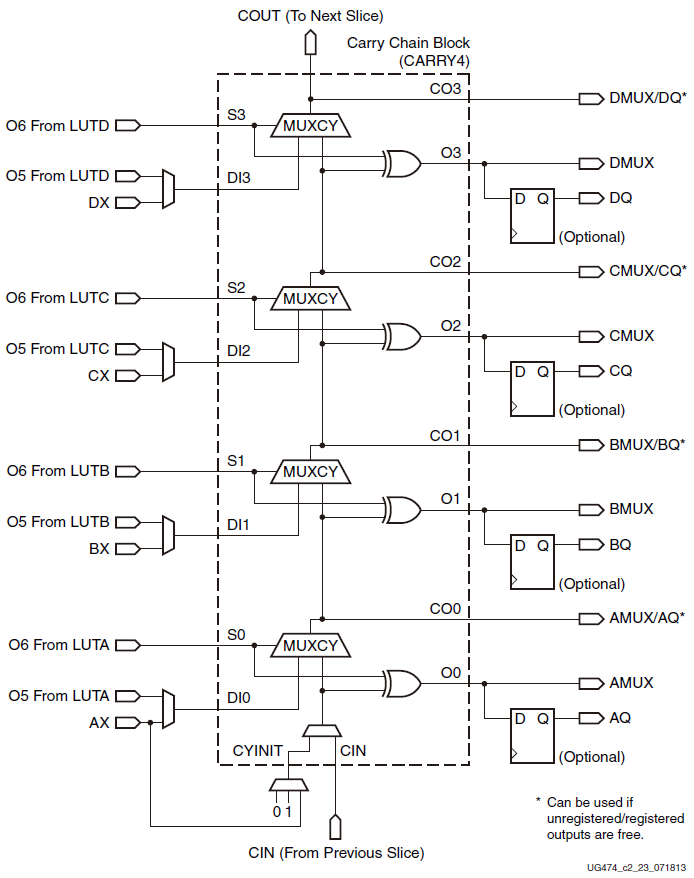

# 算术单元

用于整数运算的ALU中的加减法运算

## 设计细节

由于Xilinx Vivado编译器

在对于溢出位的处理上利用额外的加法器单元计算

非常浪费FPGA上的设计资源

因此使用Xilinx 7-Series FPGA(非UltraScale器件)中

Configurable Logic Block内的

Carry Logic(CARRY4)所对应的原语设计该部分

因为CARRY4仅适用于加法的进位处理

因此需要配合Configurable Logic Block

中的LUT单元内的异或逻辑共同构成加法运算器

## 应用位置

通常的处理器中对于加减法溢出是会产生异常的

该部分在设计时为了保证通用性

使用CARRY4最高两位的进位信号进行有符号和无符号的溢出判断

虽然在RISC-V计算加减法的过程中

是通过软件方式对加减法溢出进行判定

但是由于涉及到整型数字大小比较

因此在ALU中不能直接使用Verilog HDL的加法/减法逻辑