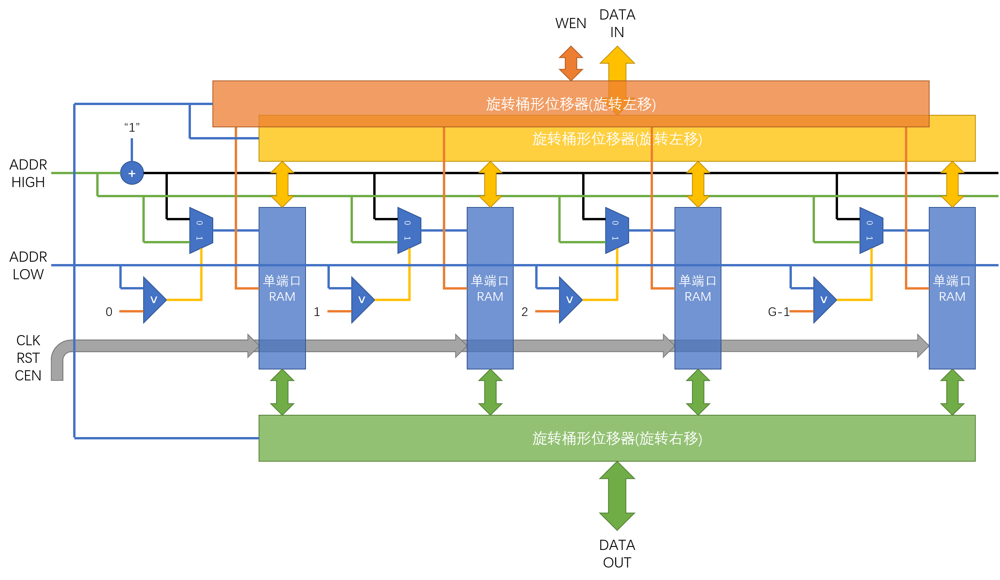
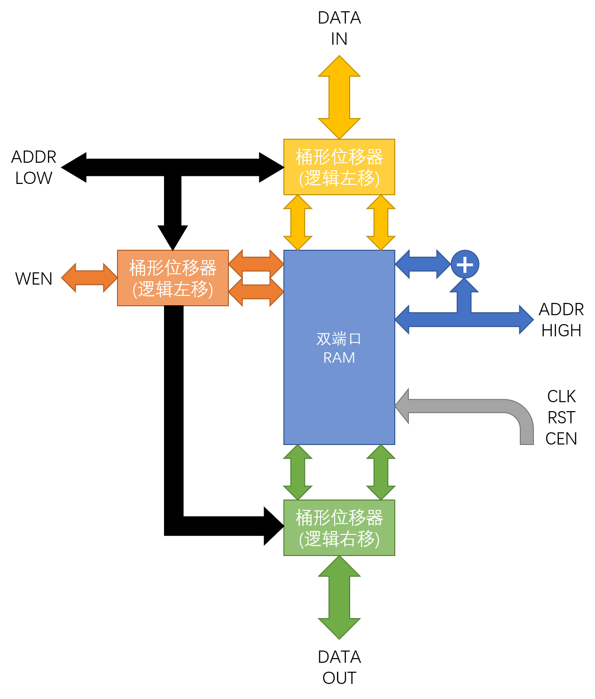

# 基于Block RAM的低位交叉存储单端口RAM/双端口RAM基本变宽存储单元

可从任意单元地址开始连续读取若干组的存储单元

主要应用了Xilinx Parameterized Macro(XPM)

使用XPM_MEMORY_SPRAM(Single Port RAM)

配合旋转桶形位移器实现低位交叉存储单端口RAM基本变宽存储单元

使用XPM_MEMORY_TDPRAM(True Dual Port RAM)

配合逻辑桶形位移器双端口RAM基本变宽存储单元

具体使用参考UG953文档中的模板进行实例化，代码中有较为详细的注释

## 低位交叉存储单端口RAM基本变宽存储单元

## 双端口RAM基本变宽存储单元

